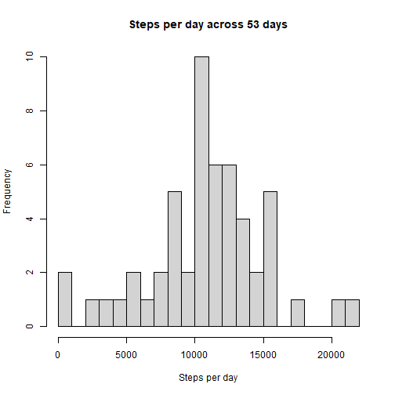
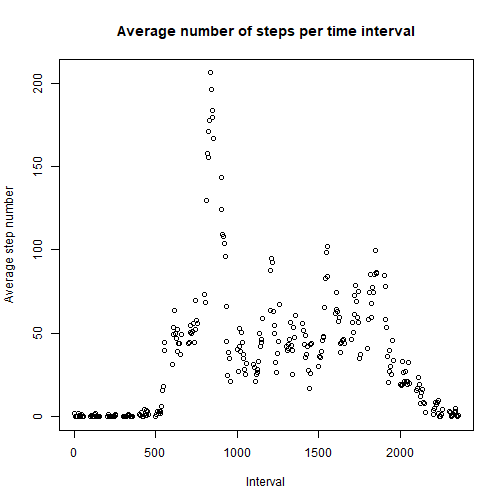
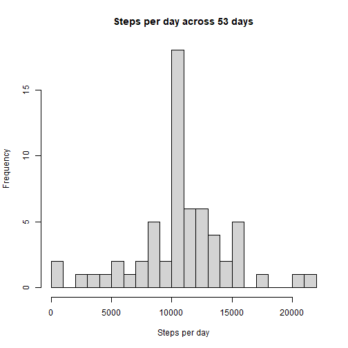
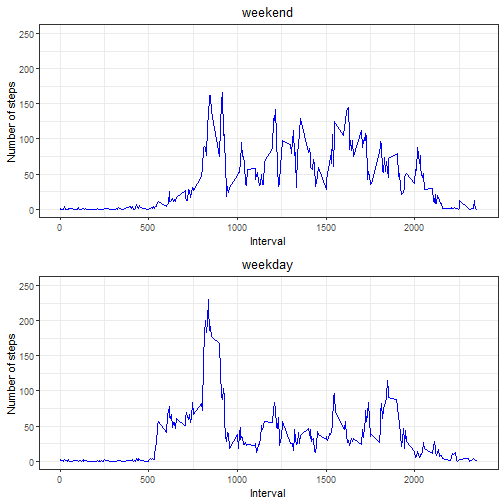

## Fitbit steps assignment

date: 2024-03-12

### Importing the data
If running the code locally, set your own working directory:


```r
#setwd("your_directory")
data <- read.csv("activity.csv")
```

## What is mean total number of steps taken per day?


```r
library(dplyr)

data_nona <- subset(data, !is.na(data$steps))
daily_steps <- data_nona %>% group_by(date) %>% summarise(steps = sum(steps,na.rm = TRUE))
#if you check the length of this new dataset, you get 53 observations (days)
steps_day <- daily_steps$steps
#max(steps_day) = 21194

hist(steps_day,breaks = 20, xlim = c(0,22000), main = "Steps per day across 53 days", xlab = "Steps per day")
```



```r
print(paste("The mean steps per day is ", as.character(round(mean(steps_day),2)), "and the median is ", as.character(median(steps_day)),"."))
```

```
## [1] "The mean steps per day is  10766.19 and the median is  10765 ."
```


## What is the average daily activity pattern?


```r
steps_interval <- data_nona %>% group_by(interval) %>% summarise(steps = mean(steps))
head(steps_interval)
```

```
## # A tibble: 6 × 2
##   interval  steps
##      <int>  <dbl>
## 1        0 1.72  
## 2        5 0.340 
## 3       10 0.132 
## 4       15 0.151 
## 5       20 0.0755
## 6       25 2.09
```

```r
plot(steps_interval$interval,steps_interval$steps, main = "Average number of steps per time interval",ylab = "Average step number", xlab = "Interval")
```



```r
max_interval = steps_interval$interval[which(steps_interval$steps==max(steps_interval$steps))]
print(paste("The daily 5-minute interval that contains the highest average number of steps is ",max_interval,"."))
```

```
## [1] "The daily 5-minute interval that contains the highest average number of steps is  835 ."
```


## Inputing missing values - does it make a difference?


```r
na <- subset(data, is.na(data$steps))
na_number <- length(subset(data$steps, is.na(data$steps)))
print(paste("The total number of observations with missing values is ", as.character(na_number), "."))
```

```
## [1] "The total number of observations with missing values is  2304 ."
```

```r
daily_mean_steps <- data %>% group_by(date) %>% summarise(steps = mean(steps,na.rm = TRUE))
daily_mean_steps <- subset (daily_mean_steps, !is.nan (daily_mean_steps$steps))

head(daily_mean_steps)
```

```
## # A tibble: 6 × 2
##   date        steps
##   <chr>       <dbl>
## 1 2012-10-02  0.438
## 2 2012-10-03 39.4  
## 3 2012-10-04 42.1  
## 4 2012-10-05 46.2  
## 5 2012-10-06 53.5  
## 6 2012-10-07 38.2
```

There are days which are not represented when we remove NA, so for those, all observations are NA. Hence, I will use the mean 5-minute interval to fill NA.


```r
mean_step_interval <- data %>% left_join(steps_interval, by = "interval")%>%
    mutate(steps.x = ifelse(is.na(steps.x),steps.y,steps.x))
still_na_number <- length(subset(mean_step_interval$steps.x, is.na(mean_step_interval$steps.x)))

total_step_day <- mean_step_interval %>% group_by(date) %>% summarise(steps = sum(steps.x))
hist(total_step_day$steps,breaks = 20, xlim = c(0, 22000),main = "Steps per day across 53 days", xlab = "Steps per day")
```



```r
print(paste("The mean steps per day is ", as.character(round(mean(total_step_day$steps),2)), "and the median is ", as.character(round(median(total_step_day$steps),2),".")))
```

```
## [1] "The mean steps per day is  10766.19 and the median is  10766.19"
```

```r
print("The mean is the same, while the median has changed slightly, being now equal to the mean.")
```

```
## [1] "The mean is the same, while the median has changed slightly, being now equal to the mean."
```

```r
print("Since we are inputting the missing data based on existing data, the impact is soft, as desirable.")
```

```
## [1] "Since we are inputting the missing data based on existing data, the impact is soft, as desirable."
```


```r
#Are there differences in activity patterns between weekdays and weekends?


week_step <- mean_step_interval %>%
    mutate(date = as.POSIXct(date,format ="%Y-%m-%d"))
week_step <- week_step %>%
    mutate(week_day = weekdays(date))

#Note - Since I am using a Portuguese computer, my default POSIXct object weekdays are in #Portuguese. To run this on your computer, have a list of weekdays as in local language.

week_list = c("segunda-feira","terça-feira","quarta-feira","quinta-feira","sexta-feira")
weekend_list =c("sábado","domingo")

week_step <- week_step %>%
    mutate(week_factor = ifelse(week_day %in% weekend_list, "weekend", "weekday"))
    
weekday_only <- subset(week_step,week_step$week_factor == "weekday")
weekend_only <- subset(week_step,week_step$week_factor == "weekend")

weekday_mean_steps <- weekday_only %>% group_by(interval) %>% summarise(steps = mean(steps.x,na.rm = TRUE))
weekend_mean_steps <- weekend_only %>% group_by(interval) %>% summarise(steps = mean(steps.x,na.rm = TRUE))

library (ggplot2)
library(gridExtra)

we <- ggplot(weekend_mean_steps,aes(interval,steps),type = "l")
wd <- ggplot(weekday_mean_steps,aes(interval,steps),type = "l") 

p1 <- we + theme_bw() + geom_line(col = "blue") + ggtitle("weekend")+theme(plot.title = element_text(hjust = 0.5)) +
    ylab("Number of steps") + xlab("Interval") + ylim (0,250)
p2 <- wd + theme_bw() +  geom_line(col="blue")+ ggtitle("weekday")+theme(plot.title = element_text(hjust = 0.5)) +
    ylab("Number of steps") + xlab("Interval")+ ylim (0,250)
grid.arrange(p1,p2)
```



```r
print("At first glance, there are differences between the number of steps by time interval, taken on a weekend versus a week day. the weekday has a higher number of steps in early intervals and arrives at the highest peak of activity, while the weekend has an overall higher activity on the second half of the daily interval, extending more to the lattest intervals.")
```

```
## [1] "At first glance, there are differences between the number of steps by time interval, taken on a weekend versus a week day. the weekday has a higher number of steps in early intervals and arrives at the highest peak of activity, while the weekend has an overall higher activity on the second half of the daily interval, extending more to the lattest intervals."
```

